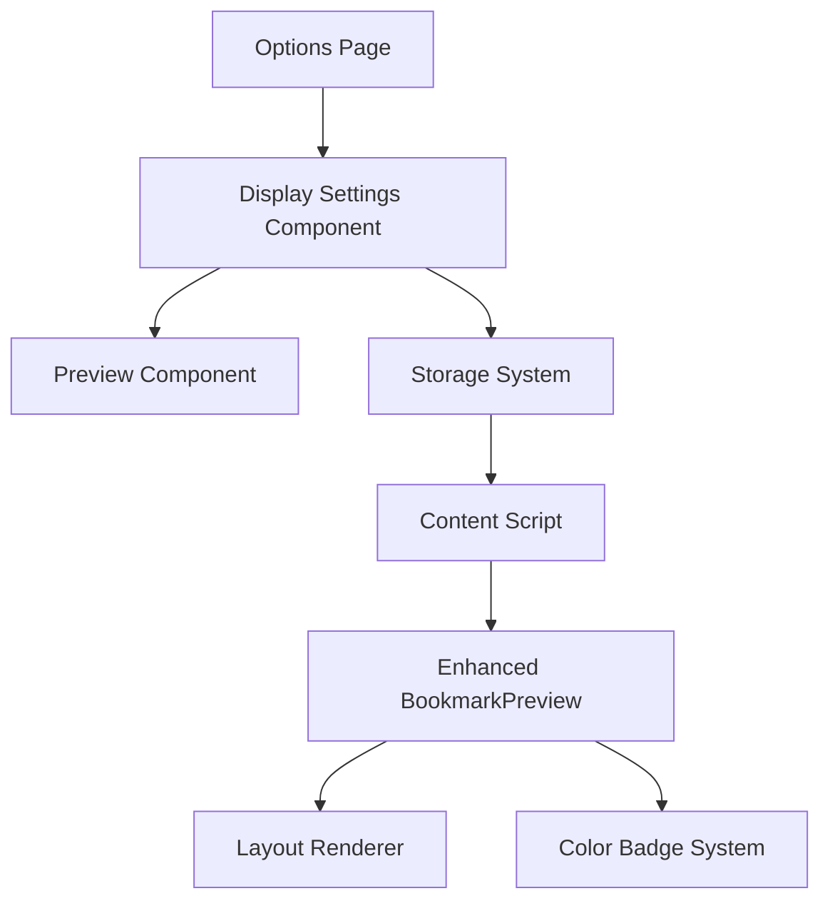

# Design Document: Customizable Bookmark Display Options

## Overview

This design document outlines the implementation approach for customizable bookmark display options in Hoarder's Pipette. The feature will extend the existing bookmark rendering system to support user-configurable layouts, information visibility toggles, and color-coded styling based on bookmark metadata.

## Architecture

### High-Level Architecture

The customizable display system will be built on top of the existing React-based content injection and options page infrastructure. The design follows a layered approach:

1. **Storage Layer**: Extended browser storage for display preferences
2. **Configuration Layer**: Settings interface in the options page
3. **Rendering Layer**: Enhanced bookmark display components
4. **Preview Layer**: Real-time preview system for settings

### Component Relationships



## Components and Interfaces

### 1. Display Preferences Schema

```typescript
interface DisplayPreferences {
  layout: 'compact' | 'detailed'
  visibility: {
    tags: boolean
    description: boolean
    dateSaved: boolean
    thumbnail: boolean
  }
  colorBadges: {
    enabled: boolean
    useCustomColors: boolean
    customColors: Record<string, ColorConfig> // listName -> color config
  }
}

interface ColorConfig {
  background: string
  text: string
  border: string
}
```

### 2. Enhanced Storage System

**File**: `src/schemas/display-options.ts`
- Extends existing options schema with display preferences
- Provides validation and default values
- Integrates with existing `atomWithBrowserStorage` pattern

**File**: `src/atoms/storage.ts` (Extended)
- Adds `displayPreferencesAtom` using the same pattern as `optionsAtom`
- Maintains consistency with existing storage architecture

### 3. Settings Interface Components

**File**: `src/entrypoints/options/components/DisplaySettings.tsx`
- Main settings component with layout selection
- Visibility toggles for each information element
- Color badge enable/disable toggle
- Option to use custom colors vs hash-generated colors
- Integrates with existing options page routing

**File**: `src/entrypoints/options/components/ColorCustomization.tsx`
- Interface for customizing colors per list
- Color picker for each discovered list
- Preview of color combinations
- Reset to default hash-generated colors

**File**: `src/entrypoints/options/components/BookmarkPreview.tsx`
- Real-time preview component showing sample bookmarks
- Reflects current settings changes immediately
- Uses same rendering logic as content script

### 4. Enhanced Bookmark Rendering

**File**: `src/components/BookmarkPreview.tsx` (Enhanced)
- Consumes display preferences from storage
- Renders bookmarks according to selected layout
- Applies visibility settings and color badges
- Maintains existing functionality and performance

**File**: `src/components/BookmarkLayouts.tsx` (New)
- Separate layout components for compact and detailed views
- Reusable layout logic
- Consistent styling and behavior

### 5. Color Badge System

**File**: `src/components/ColorBadge.tsx` (New)
- Generates consistent colors based on list names using hash function
- Allows user customization of colors per list
- Supports different color schemes and accessibility
- Minimal visual impact on readability

**File**: `src/utils/colorGeneration.ts` (New)
- Hash-based color generation for consistent list colors
- Predefined accessible color palette
- Color contrast validation utilities

## Data Models

### Display Preferences Storage

```typescript
// Default preferences
const DEFAULT_DISPLAY_PREFERENCES: DisplayPreferences = {
  layout: 'detailed',
  visibility: {
    tags: true,
    description: true,
    dateSaved: true,
    thumbnail: true
  },
  colorBadges: {
    enabled: false,
    useCustomColors: false,
    customColors: {} // Empty object, colors generated by hash by default
  }
}

// Predefined accessible color palette
const ACCESSIBLE_COLOR_PALETTE: ColorConfig[] = [
  { background: '#e3f2fd', text: '#1565c0', border: '#bbdefb' },
  { background: '#f3e5f5', text: '#7b1fa2', border: '#e1bee7' },
  { background: '#e8f5e8', text: '#2e7d32', border: '#c8e6c9' },
  // ... more accessible color combinations
]
```

### Color Badge Logic

```typescript
// Hash-based color generation for consistent colors
function generateListColor(listName: string): ColorConfig {
  const hash = hashString(listName)
  const colorIndex = hash % ACCESSIBLE_COLOR_PALETTE.length
  return ACCESSIBLE_COLOR_PALETTE[colorIndex]
}

// User can override with custom colors
function getListColor(
  listName: string,
  preferences: DisplayPreferences
): ColorConfig {
  if (preferences.colorBadges.useCustomColors &&
      preferences.colorBadges.customColors[listName]) {
    return preferences.colorBadges.customColors[listName]
  }
  return generateListColor(listName)
}
```

## Error Handling

### Storage Errors
- Graceful fallback to default preferences if storage fails
- Error logging for debugging
- User notification for critical storage issues

### Rendering Errors
- Fallback to default layout if custom preferences cause issues
- Error boundaries around preview components
- Maintain core functionality even if customization fails

### Migration Handling
- Automatic migration of preferences when schema changes
- Backward compatibility with existing installations
- Safe defaults for new preference options

## Testing Strategy

### Unit Tests
- Display preferences schema validation
- Color generation algorithms
- Layout rendering logic
- Storage operations

### Integration Tests
- Settings page functionality
- Real-time preview updates
- Storage persistence across sessions
- Content script integration

### Visual Regression Tests
- Layout consistency across different preferences
- Color badge appearance
- Responsive behavior
- Dark/light theme compatibility

## Implementation Phases

### Phase 1: Core Infrastructure
1. Extend storage schema and atoms
2. Create basic layout components
3. Implement settings interface structure

### Phase 2: Layout System
1. Implement compact and detailed layouts
2. Add visibility toggles functionality
3. Integrate with existing BookmarkPreview

### Phase 3: Color Badge System
1. Implement color generation logic
2. Add color badge components
3. Integrate badge display with layouts

### Phase 4: Preview and Polish
1. Implement real-time preview
2. Add accessibility improvements
3. Performance optimization
4. Cross-browser testing

## Technical Considerations

### Performance
- Lazy loading of preview components
- Memoization of color calculations
- Minimal re-renders on preference changes
- Efficient storage operations

### Accessibility
- WCAG 2.1 AA compliance for color badges
- Keyboard navigation for settings
- Screen reader compatibility
- High contrast mode support

### Browser Compatibility
- Chrome and Firefox support
- Consistent behavior across browsers
- Graceful degradation for unsupported features
- Extension API compatibility

### Scalability
- Extensible preference schema
- Modular component architecture
- Easy addition of new layout options
- Flexible color scheme system

## Security Considerations

- Sanitization of user preferences
- Validation of stored data
- Protection against XSS in preview components
- Safe handling of bookmark metadata

## Migration Strategy

### Existing Users
- Automatic detection of first-time setup
- Default preferences that match current behavior
- Optional migration wizard for advanced users
- Preservation of existing functionality

### Future Enhancements
- Extensible schema design
- Plugin architecture for custom layouts
- Import/export of preferences
- Sync across devices (future consideration)
